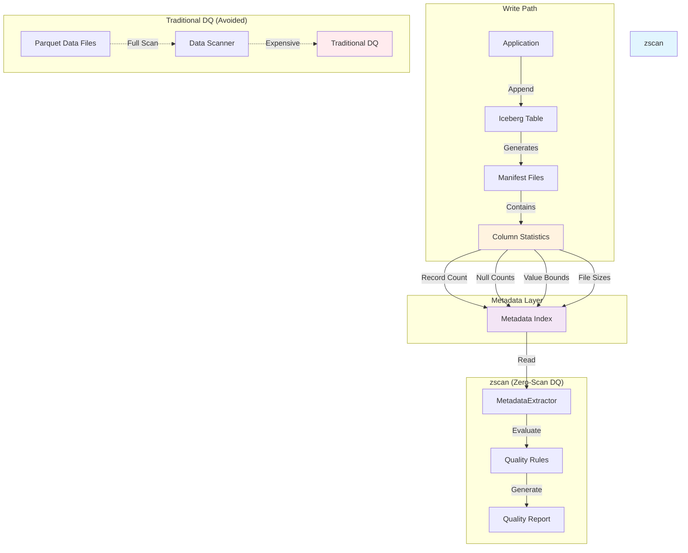
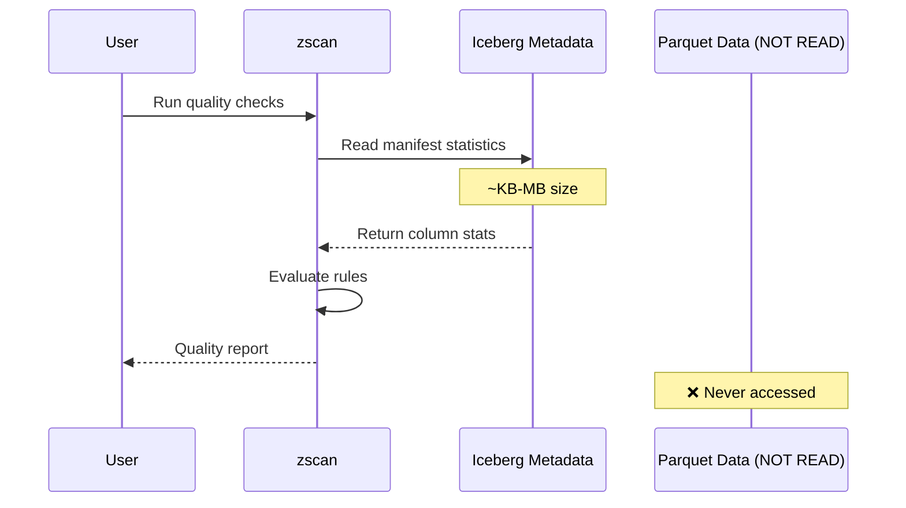
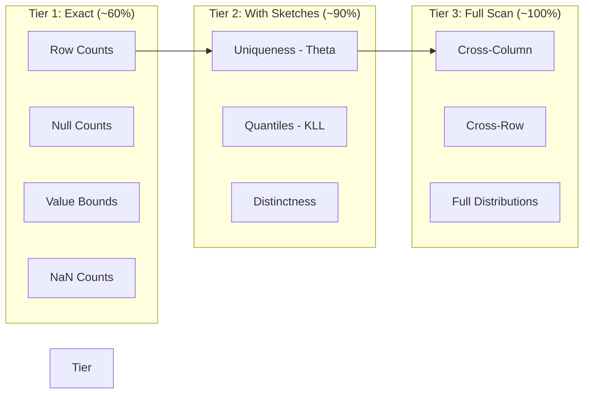

# zscan

**Zero-scan data quality observability via Apache Iceberg table metadata.**

[](https://www.python.org/downloads/)
[](LICENSE)
[](https://github.com/astral-sh/ruff)

---

## What is zscan?

zscan is a **zero-scan data quality** tool that monitors data quality using **only metadata** from Apache Iceberg tables — without ever reading actual Parquet data files.

Traditional data quality tools scan entire datasets (GB–TB) to validate data. zscan instead reads **Iceberg manifest statistics** (record counts, null counts, value bounds) that are already computed during writes and stored in lightweight metadata files (KB–MB).

### Key Benefits

| Benefit | Traditional DQ | zscan |
|---------|---------------|-------|
| **Speed** | Minutes to hours | Milliseconds |
| **Cost** | High (full table scans) | Near-zero (metadata only) |
| **Latency** | 2–24 hours | Real-time (< 20 min) |
| **Coverage** | ~100% of rules | ~60% exact, ~90% with extensions |

---

## How It Works

### Architecture Overview



### Zero-Scan vs Full-Scan



---

## Three-Tier Rule Coverage



| Tier | Source | What It Answers | Coverage |
|------|--------|-----------------|----------|
| **Tier 1** | Manifest stats only | Row counts, nulls, bounds, NaNs | ~60% |
| **Tier 2** | Stats + Puffin sketches | Uniqueness, quantiles, distinctness | ~90% |
| **Tier 3** | Full data scan | Cross-column, correlations | ~100% |

---

## Installation

### Prerequisites

- Python 3.14+
- [uv](https://docs.astral.sh/uv/) (recommended) or pip

### Using uv (Recommended)

```bash
# Clone the repository
git clone https://github.com/sendalcurian/zscan.git
cd zscan

# Install with uv
uv sync

# Or install with dev dependencies
uv sync --extra dev
```

### Using pip

```bash
pip install -e .

# Or with dev dependencies
pip install -e ".[dev]"
```

---

## Quick Start

### 1. Create a Sample Iceberg Table

```python
import pyarrow as pa
from pyiceberg.catalog import SqlCatalog
from pathlib import Path

# Setup catalog
warehouse = Path("./warehouse")
warehouse.mkdir(exist_ok=True)

catalog = SqlCatalog(
    "default",
    **{
        "uri": f"sqlite:///{warehouse / 'catalog.db'}",
        "warehouse": str(warehouse),
    },
)

# Create table
catalog.create_namespace_if_not_exists("mydb")
schema = pa.schema([
    pa.field("id", pa.int64()),
    pa.field("name", pa.string()),
    pa.field("value", pa.float64()),
])

table = catalog.create_table_if_not_exists("mydb.data", schema=schema)

# Insert data
data = pa.table({
    "id": [1, 2, 3],
    "name": ["Alice", "Bob", None],
    "value": [10.0, 20.0, 30.0],
})
table.append(data)
```

### 2. Run Quality Checks (Python API)

```python
from zscan import MetadataExtractor, QualityChecker
from zscan.core.rules import NullRateRule, RangeViolationRule

# Extract metadata (zero-scan!)
extractor = MetadataExtractor("./warehouse")
metadata = extractor.get_table_metadata("mydb.data")

# Configure rules
checker = QualityChecker(extractor)
checker.add_rule(NullRateRule(default_threshold=0.1))
checker.add_rule(RangeViolationRule(column_bounds={"value": (0, None)}))

# Run checks
report = checker.run_checks("mydb.data", metadata=metadata)

if report.passed:
    print("✅ All checks passed!")
else:
    print(f"❌ {report.total_violations} violations found")
    for result in report.failed_rules:
        for v in result.violations:
            print(f"   - {v.message}")
```

### 3. Run Quality Checks (CLI)

```bash
# Run checks against a table
zscan check mydb.data --warehouse ./warehouse

# Inspect table metadata
zscan inspect mydb.data --warehouse ./warehouse

# Compare snapshots
zscan diff mydb.data 1234567890 9876543210 --warehouse ./warehouse

# JSON output
zscan check mydb.data --warehouse ./warehouse --json
```

---

## Project Structure

```
zscan/
├── src/
│   └── zscan/
│       ├── __init__.py          # Package exports
│       ├── cli.py               # Typer CLI application
│       ├── core/
│       │   ├── __init__.py
│       │   ├── metadata.py      # MetadataExtractor class
│       │   ├── checks.py        # QualityChecker orchestration
│       │   └── rules.py         # Rule definitions
│       ├── models/
│       │   ├── __init__.py
│       │   └── schemas.py       # Configuration schemas
│       └── utils/
│           ├── __init__.py
│           └── logging.py       # Logging configuration
├── tests/
│   ├── conftest.py              # Test fixtures
│   ├── test_metadata.py         # Metadata tests
│   └── test_checks.py           # Quality check tests
├── examples/
│   └── demo.py                  # Full working demo
├── pyproject.toml               # Project configuration
├── README.md                    # This file
├── LICENSE                      # MIT License
└── plan.md                      # Research plan
```

---

## API Reference

### MetadataExtractor

```python
from zscan import MetadataExtractor

extractor = MetadataExtractor("/path/to/warehouse")

# Get complete table metadata
metadata = extractor.get_table_metadata("db.table")

# Compare snapshots
diff = extractor.get_snapshot_diff("db.table", snap_id_1, snap_id_2)

# Query with DuckDB (zero-scan)
result = extractor.query_with_duckdb(
    "db.table",
    "SELECT * FROM iceberg_metadata('{table}')"
)
```

### QualityChecker

```python
from zscan import QualityChecker
from zscan.core.rules import *

checker = QualityChecker(extractor)

# Add rules
checker.add_rule(RowCountDriftRule(threshold_pct=20.0))
checker.add_rule(NullRateRule(default_threshold=0.1))
checker.add_rule(RangeViolationRule(column_bounds={"age": (0, 150)}))
checker.add_rule(FileCountAnomalyRule())

# Run checks
report = checker.run_checks("db.table")
```

### Built-in Rules

| Rule | Description | Default Threshold |
|------|-------------|-------------------|
| `RowCountDriftRule` | Detects significant row count changes | 20% |
| `NullRateRule` | Checks null rate thresholds per column | 10% |
| `RangeViolationRule` | Validates value bounds | Per-column |
| `FileCountAnomalyRule` | Detects file count spikes/drops | 100%/50% |

### Custom Rules

```python
from zscan.core.rules import Rule, RuleResult, CheckStatus

class MyCustomRule(Rule):
    def __init__(self):
        super().__init__(
            name="my_rule",
            description="Custom quality check",
        )

    def evaluate(self, metadata):
        # Your logic here
        return RuleResult(
            rule_name=self.name,
            status=CheckStatus.PASSED,
        )
```

---

## Metadata Available (Zero-Scan)

Each Iceberg data file exposes these statistics via manifests:

| Statistic | Description | Use Case |
|-----------|-------------|----------|
| `record_count` | Number of records | Row count drift detection |
| `file_size_in_bytes` | File size | Storage anomaly detection |
| `column_sizes` | Size per column | Column growth monitoring |
| `value_counts` | Non-null value count | Completeness checks |
| `null_value_counts` | Null count | Null rate monitoring |
| `nan_value_counts` | NaN count | Float data quality |
| `lower_bounds` | Min values | Range validation |
| `upper_bounds` | Max values | Range validation |

---

## Development

### Setup Development Environment

```bash
# Install with dev dependencies
uv sync --extra dev

# Run tests
uv run pytest

# Run tests with coverage
uv run pytest --cov=zscan --cov-report=html

# Lint code
uv run ruff check .

# Format code
uv run ruff format .

# Type checking
uv run mypy src/
```

### Pre-commit Hooks

```bash
# Install pre-commit hooks
uv run pre-commit install

# Run all hooks
uv run pre-commit run --all-files
```

---

## Examples

### Run the Demo

```bash
# Full working example with sample data
uv run python examples/demo.py
```

The demo will:
1. Create a sample Iceberg table with quality issues
2. Extract metadata (zero-scan)
3. Run quality checks
4. Display a formatted report

---

## References

- [Zero-Scan Data Quality](https://arxiv.org/abs/2605.30308) (arXiv:2605.30308, SIGMOD 2026) — LinkedIn's production deployment
- [Apache Iceberg Specification](https://iceberg.apache.org/spec/) — Manifest and metadata format
- [PyIceberg Documentation](https://py.iceberg.apache.org/) — Python Iceberg library
- [DuckDB Iceberg Extension](https://duckdb.org/docs/extensions/iceberg) — SQL-based metadata queries

---

## License

MIT License - see [LICENSE](LICENSE) for details.

---

## Contributing

Contributions are welcome! Please see [CONTRIBUTING.md](CONTRIBUTING.md) for guidelines.

---

## Acknowledgments

Built with:
- [PyIceberg](https://py.iceberg.apache.org/) - Apache Iceberg Python library
- [DuckDB](https://duckdb.org/) - In-process SQL OLAP database
- [Typer](https://typer.tiangolo.com/) - CLI framework
- [Rich](https://rich.readthedocs.io/) - Terminal formatting
- [uv](https://docs.astral.sh/uv/) - Python package manager
- [Ruff](https://docs.astral.sh/ruff/) - Python linter/formatter
